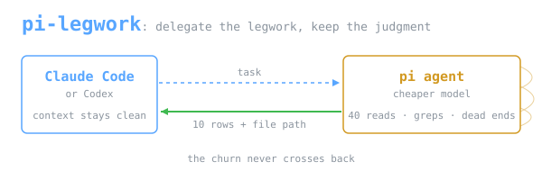

Use **Pi** or **Codex** to delegate research — surveys, grep sweeps,
git archaeology, log scans, web lookups — to a cheaper
**[pi](https://github.com/badlogic/pi-mono) agent**.

```bash
pi-delegate "which files under src/ reference the retry helper, and what for"
```

Answering that takes about forty file reads to produce ten rows. The pi agent
does all forty in its own session and writes the full answer to a file. The
caller gets a short preview and the path; none of the reads enter its context.

The saving depends on your task, your models, your quota, and how much context
your caller already carries on every turn. No headline number ships here, and
none should be inherited — measure your own setup. When delegation is worth it
at all: [PHILOSOPHY.md](PHILOSOPHY.md).

> A case study and reference implementation, not a maintained product.

## Install

You need [pi](https://pi.dev) on `PATH` — a separate, open-source agent CLI that
runs the delegated work — plus `jq`.

```bash
npm install -g --ignore-scripts @earendil-works/pi-coding-agent   # or see pi.dev
```

Docs: [pi.dev quickstart](https://pi.dev/docs/latest/quickstart) ·
repo: [badlogic/pi-mono](https://github.com/badlogic/pi-mono)

Then pi-legwork itself:

```bash
git clone https://github.com/okkymabruri/pi-legwork && cd pi-legwork
install -m755 pi-delegate.sh ~/.local/bin/pi-delegate

pi-delegate --models                       # models pi already has configured
export PI_DELEGATE_MODEL='<provider/model>'
pi-delegate --doctor                       # checks the install, says what is missing
```

There is no default model. See [docs/PROVIDERS.md](docs/PROVIDERS.md).

**Claude Code retired:** the former plugin and `/setup-pi-legwork` command are
archived and are not supported setup paths. Do not run old setup examples.

**Pi** — use the repo-local [`skills/pi-delegate/SKILL.md`](skills/pi-delegate/SKILL.md)
as guidance. Installing the shell command above does not automatically load the
skill into Pi.

**Codex** — paste the block from
[`integrations/codex/AGENTS.md`](integrations/codex/AGENTS.md) into your
`AGENTS.md`. Codex then delegates on its own, correctly, but no token saving has
been measured on it — see [integrations/](integrations/README.md).

## Use

```bash
pi-delegate "task"                     # survey, grep sweep, inventory
pi-delegate -o /tmp/out.md "task"      # durable output path
pi-delegate -p readonly "task"         # no bash: cannot mutate anything
pi-delegate -p research "look up X"    # web tools, no bash or write
pi-delegate -2 "<the whole problem>"   # independent second opinion
```

Run it in the background; a `local` call takes 25–60s. A `-p research` call is
far slower — 298s and 582s on the two measured — because web fetches run
serially; plan 5–10 minutes. Six concurrent delegations is measured safe, each
as its own process with its own `-o` path.

The watchdog deadline follows the profile for that reason: **600s for
`local`/`readonly`, 1800s for `research`/`full`**, overridable with
`PI_DELEGATE_TIMEOUT`. A single deadline was tried and two research runs died
at 605s having already spent 2.5M and 3.2M tokens, one of them mid-sentence in
its final answer. If a run is killed anyway, the wrapper now recovers whatever
text had streamed and labels it `PARTIAL` rather than returning 0 bytes.

## When to delegate

Two gates, both must pass. **Churn ≫ output**: many reads, short answer.
**The output carries its own evidence**: checkable without redoing the work.

Full table of ~18 task shapes:
[`skills/pi-delegate/WHEN-TO-DELEGATE.md`](skills/pi-delegate/WHEN-TO-DELEGATE.md).

## Safety

The default `local` profile includes `bash`, so a delegate **can write**. Use
`-p readonly` for the enforced version.

The bundled guard blocks credential paths and destructive bash patterns. Run
`./install.sh` to expose it as the project-local
`.pi/extensions/damage-control.ts`; do **not** register it under `~/.pi`.
`pi-delegate` loads this trusted extension explicitly and binds it to this
checkout through `PI_LEGWORK_PROJECT_ROOT`, so delegated work remains protected
without making the guard ambient in unrelated Pi sessions.

Once registered it still runs inside pi's own process — a policy hook, not a
sandbox. Upstream pi has no permission system, and anything reaching the
filesystem without going through a hooked tool call is outside it. See
[docs/ARCHITECTURE.md](docs/ARCHITECTURE.md).

`readOnlyPaths` denies **writes only**; reads of those paths pass. The matcher
is pinned by a table test with no runner dependency:

```bash
node --experimental-strip-types extensions/damage-control.test.ts
./install.sh --check
```

## Docs

| | |
|---|---|
| [PHILOSOPHY.md](PHILOSOPHY.md) | Why context is the scarce resource, the gates, the measurement, honest limits |
| [docs/ARCHITECTURE.md](docs/ARCHITECTURE.md) | Diagrams: what crosses the context boundary, profiles, the guard |
| [docs/PROVIDERS.md](docs/PROVIDERS.md) | Configuring a delegate model |
| [integrations/](integrations/README.md) | Active Pi/Codex guidance and frozen historical measurements |

## License

MIT — see [LICENSE](LICENSE).

`extensions/damage-control.ts` and `damage-control-rules.json` are ported from
[disler/pi-vs-claude-code](https://github.com/disler/pi-vs-claude-code) (MIT,
© 2026 IndyDevDan) and modified. Third-party notices: [NOTICE](NOTICE).
