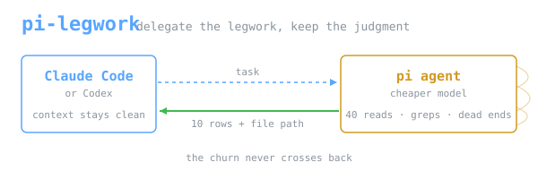

Use **Claude Code** or **Codex** to delegate research — surveys, grep sweeps,
git archaeology, log scans, web lookups — to a cheaper
**[pi](https://github.com/badlogic/pi-mono) agent**.

```bash
pi-delegate "which files under src/ reference the retry helper, and what for"
```

Answering that takes about forty file reads to produce ten rows. The pi agent
does all forty in its own session and writes the full answer to a file. Claude
Code gets a short preview and the path — none of the reads enter its context.

**Measured on one comparison:** 0.23× as many caller tokens, identical answers.
One task class, two runs per arm — see [PHILOSOPHY.md](PHILOSOPHY.md).

> A case study and reference implementation, not a maintained product.

## Install

You need [pi](https://pi.dev) on `PATH` — a separate, open-source agent CLI that
runs the delegated work — plus `jq`.

```bash
npm install -g --ignore-scripts @earendil-works/pi-coding-agent   # or see pi.dev
```

Docs: [pi.dev quickstart](https://pi.dev/docs/latest/quickstart) ·
repo: [badlogic/pi-mono](https://github.com/badlogic/pi-mono)

Then pi-legwork itself:

```bash
git clone https://github.com/okkymabruri/pi-legwork && cd pi-legwork
install -m755 pi-delegate.sh ~/.local/bin/pi-delegate

pi-delegate --models                       # models pi already has configured
export PI_DELEGATE_MODEL='<provider/model>'
pi-delegate --doctor                       # checks the install, says what is missing
```

There is no default model. See [docs/PROVIDERS.md](docs/PROVIDERS.md).

**Claude Code** — install the plugin, which adds the skill and a setup command:

```
/plugin marketplace add okkymabruri/pi-legwork
/plugin install pi-legwork@pi-legwork
/setup-pi-legwork
```

**Codex** — paste the block from
[`integrations/codex/AGENTS.md`](integrations/codex/AGENTS.md) into your
`AGENTS.md`. Codex then delegates on its own, correctly, but no token saving has
been measured on it — see [integrations/](integrations/README.md).

## Use

```bash
pi-delegate "task"                     # survey, grep sweep, inventory
pi-delegate -o /tmp/out.md "task"      # durable output path
pi-delegate -p readonly "task"         # no bash: cannot mutate anything
pi-delegate -p research "look up X"    # web tools, no bash or write
pi-delegate -2 "<the whole problem>"   # independent second opinion
```

Run it in the background; a call takes 25–60s. Six concurrent delegations is
measured safe, each as its own process with its own `-o` path.

## When to delegate

Two gates, both must pass. **Churn ≫ output**: many reads, short answer.
**The output carries its own evidence**: checkable without redoing the work.

Full table of ~18 task shapes:
[`skills/pi-delegate/WHEN-TO-DELEGATE.md`](skills/pi-delegate/WHEN-TO-DELEGATE.md).

## Safety

The default `local` profile includes `bash`, so a delegate **can write**. Use
`-p readonly` for the enforced version. The bundled guard blocks credential
paths but runs inside pi's own process — it is not a sandbox, and upstream pi
has no permission system. See [docs/ARCHITECTURE.md](docs/ARCHITECTURE.md).

## Docs

| | |
|---|---|
| [PHILOSOPHY.md](PHILOSOPHY.md) | Why context is the scarce resource, the gates, the measurement, honest limits |
| [docs/ARCHITECTURE.md](docs/ARCHITECTURE.md) | Diagrams: what crosses the context boundary, profiles, the guard |
| [docs/PROVIDERS.md](docs/PROVIDERS.md) | Configuring a delegate model |
| [integrations/](integrations/README.md) | Per-host setup; only Claude Code is measured |

## License

MIT — see [LICENSE](LICENSE).
