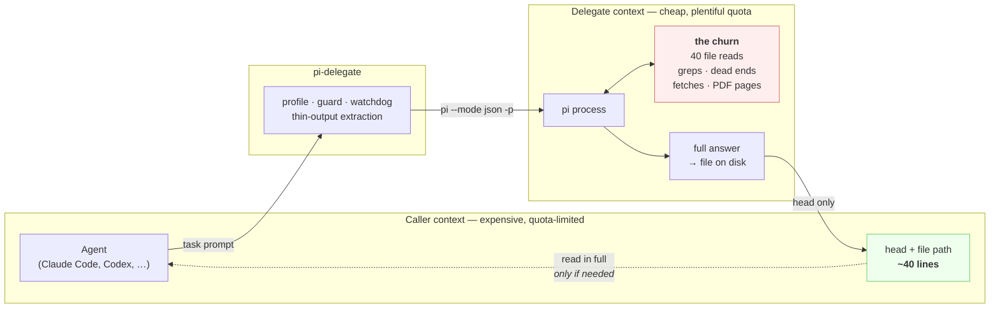
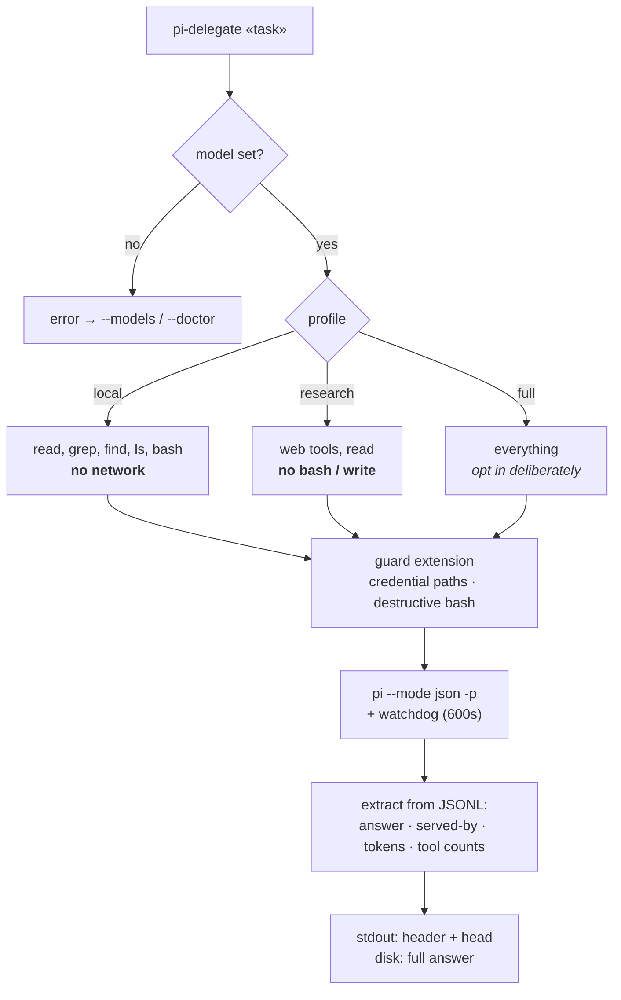
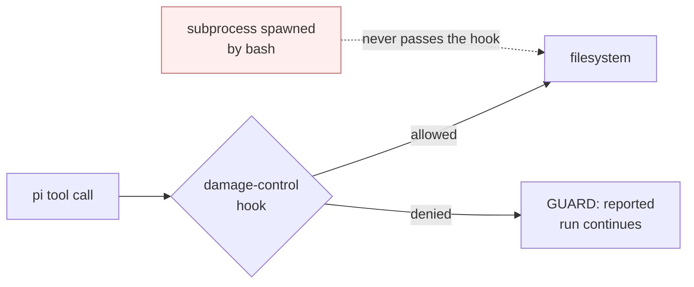
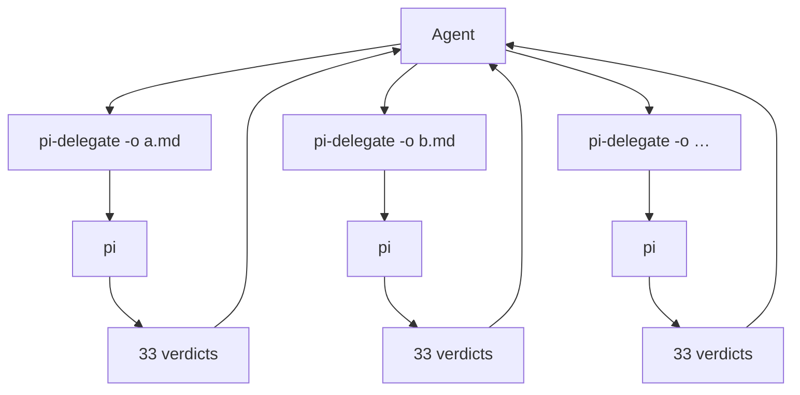

# Architecture

One idea, drawn: **the churn stays on the right of the line; only evidence
crosses back.**

The dotted arrow is the one that undoes the saving. Reading the whole output
file re-imports the cost just avoided, so it is the exception, not the default.

## What the wrapper actually does

## Why the profiles are split

`research` and `local` are kept apart because the combination is the danger, not
either half:

- an agent with **network egress** can send anything it read out via a URL
- an agent with **bash** can be aimed at a path or a command
- fetched web content is **untrusted input**

Separately, each is bounded. Together, an injected page has something to aim at.
Splitting removes the combination rather than policing it. `full` exists, and
asks to be chosen on purpose.

The same split prices the call: every registered tool's schema ships on every
request, so `local` costs ~3.1k input tokens and `research` ~4.7k.

## Where the guard sits, and what it is not

The hook runs **inside pi's own process**. Upstream states plainly that pi has
no built-in permission system and recommends containerization for real
boundaries.

So the dotted arrow is real: anything reaching the filesystem without passing
through a hooked tool call is outside the guard by construction. That is
proportionate for read-only surveys, where the realistic failure is a credential
path being read and pattern-matching catches it. It does not survive being
load-bearing.

## Fan-out

Up to 6 concurrent, measured safe. Two rules make it work:

- **Each worker reduces.** 200 files ÷ 6 workers returning one line each ≈ 20k
  tokens. 200 individual calls ≈ 660k — worse than doing it locally.
- **Each is its own background process.** Grouped in one shell with `&` … `wait`,
  the children die when the parent is reaped, leaving `rc=0` and an empty answer
  that reads exactly like the model finding nothing.

Six is safe **because the delegates only read**. It is not a budget that
transfers to writes.
