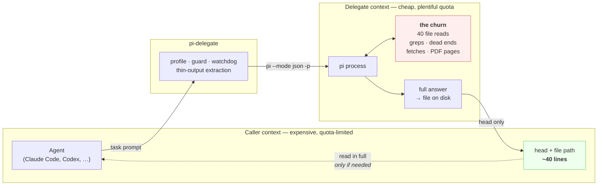
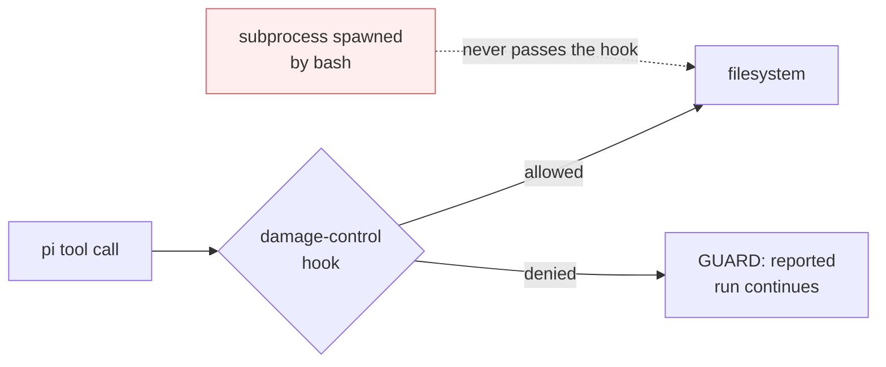
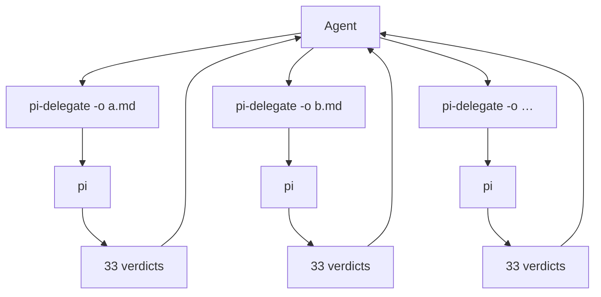

# Architecture

One idea, drawn: **the churn stays on the right of the line; only evidence
crosses back.**



The dotted arrow is the one that undoes the saving. Reading the whole output
file re-imports the cost just avoided, so it is the exception, not the default.

## What the wrapper actually does

```mermaid
flowchart TD
    S["pi-delegate «task»"] --> M{"model set?"}
    M -- "no" --> MX["error → --models / --doctor"]
    M -- "yes" --> PR{"profile"}

    PR -- "readonly" --> RO["read, grep, find, ls<br/><b>cannot mutate</b>"]
    PR -- "local" --> L["+ bash<br/><b>CAN write</b>"]
    PR -- "research" --> RS["web tools, read, mcp<br/><b>no bash / write</b>"]
    PR -- "full" --> FU["everything<br/><i>opt in deliberately</i>"]

    RO --> G[
    L --> G["guard extension<br/>credential paths · destructive bash"]
    RS --> G
    FU --> G

    G --> RUN["pi --mode json -p<br/>+ watchdog (600s local · 1800s research)"]
    RUN --> EX["extract from JSONL:<br/>answer · served-by · tokens · tool counts<br/><i>killed run: salvage streamed text</i>"]
    EX --> OUT["stdout: header + head<br/>disk: full answer"]
```

## Why the profiles are split

**`readonly` versus `local` is the one that surprises people.** `local` carries
`bash`, so a delegate under it can write, delete and spawn subprocesses — asked
to overwrite a file, it will. Read-only under `local` is a property of the tasks
you send, not a boundary. `readonly` drops bash and is the enforced version;
surveys, greps and file reads do not need bash anyway.

`research` and `local` are kept apart for a different reason — the combination is
the danger, not either half:

- an agent with **network egress** can send anything it read out via a URL
- an agent with **bash** can be aimed at a path or a command
- fetched web content is **untrusted input**

Separately, each is bounded. Together, an injected page has something to aim at.
Splitting removes the combination rather than policing it. `full` exists, and
asks to be chosen on purpose.

**`research` also carries `mcp`, and that grants more than it looks.** The
adapter registers one proxy tool rather than each server's tools, so allowlisting
`mcp` reaches every *enabled* MCP server, and the guard does not inspect calls
made through the proxy. The fail-closed boundary is the `disabled` list in
`~/.pi/agent/mcp.json`, not the profile. Keep that file an explicit allowlist and
keep `hostConfigDiscovery` off: importing host configs once pulled in a
JavaScript REPL — arbitrary code execution — into the profile that removes bash.

The same split prices the call: every registered tool's schema ships on every
request, so `local` costs ~3.1k input tokens and `research` ~4.7k.

## Where the guard sits, and what it is not



The hook runs **inside pi's own process**. Upstream states plainly that pi has
no built-in permission system and recommends containerization for real
boundaries.

So the dotted arrow is real: anything reaching the filesystem without passing
through a hooked tool call is outside the guard by construction. That is
proportionate for surveys run under `readonly`, where the realistic failure is a credential
path being read and pattern-matching catches it. It does not survive being
load-bearing.

### What `readOnlyPaths` actually protects, in bash

**Literal direct writes, and nothing else.** Say it that way rather than
"these paths are read-only", because the second reading is false and the false
assurance is worse than any single gap. `npm install` rewrites
`package-lock.json`, `uv sync` rewrites `uv.lock`, and git porcelain rewrites
`.git/` — none of them name the path, so none can ever match. Anything routed
through a variable, a command substitution or a subprocess is outside the hook
by construction, same as the dotted arrow above.

What it does buy is the accidental `> uv.lock`, `sed -i`, `rm` and
`cp x package-lock.json`. That is a guard against the model making a mistake,
not against anyone determined, and it is priced accordingly: it errs toward
permitting, because a false positive stops real work and a false negative
costs a protection that was never enforceable.

Reads of those paths pass. Two rounds of getting that wrong:

- The first check was `command.includes(rop)` in all but name, so `ls .git/refs`
  and `cat /etc/hosts` were refused as "may modify".
- The replacement matched the write verb against the **whole command**, so
  `git log --patch -- package-lock.json` matched `patch` and
  `grep -n install ~/.claude/settings.json` matched `install`. The verb now has
  to be a segment's command word, and the path has to be in that same segment.

The denied edge reports two different conditions on two different lines.
`GUARD:` counts denials. `RULES:` means the rules file was missing or
unparseable, so every tool call was refused regardless of what it asked —
before 2026-08-06 that case denied silently and returned rc=0 with no header
line at all, which reads exactly like the model finding nothing.

`extensions/damage-control.test.ts` pins all of it, including the gaps that are
deliberately left open:

```
node --experimental-strip-types extensions/damage-control.test.ts
```

## Fan-out



Up to 6 concurrent, measured safe. Two rules make it work:

- **Each worker reduces.** 200 files ÷ 6 workers returning one line each ≈ 20k
  tokens. 200 individual calls ≈ 660k — worse than doing it locally.
- **Each is its own background process.** Grouped in one shell with `&` … `wait`,
  the children die when the parent is reaped, leaving `rc=0` and an empty answer
  that reads exactly like the model finding nothing.

Six is safe **because the delegates are only reading** — under `readonly` that is enforced, under `local` it is a property of the tasks sent. It is not a budget that
transfers to writes.
